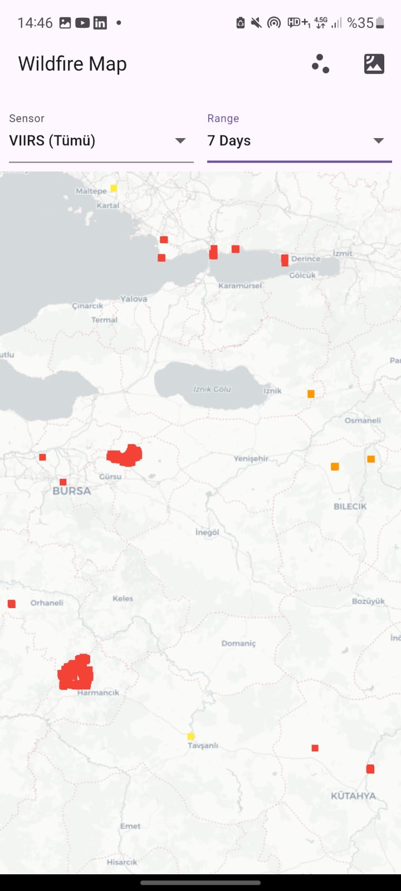
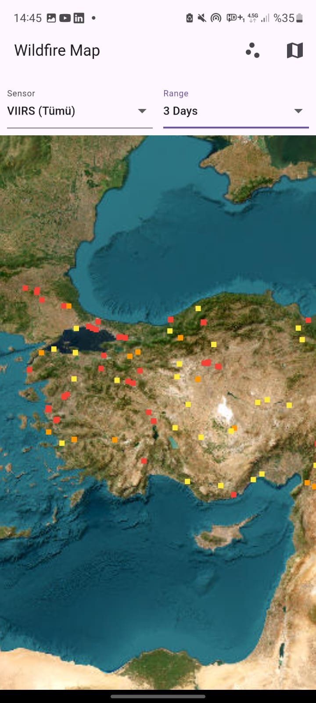
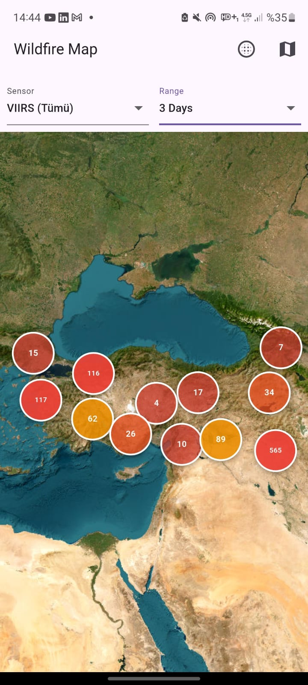
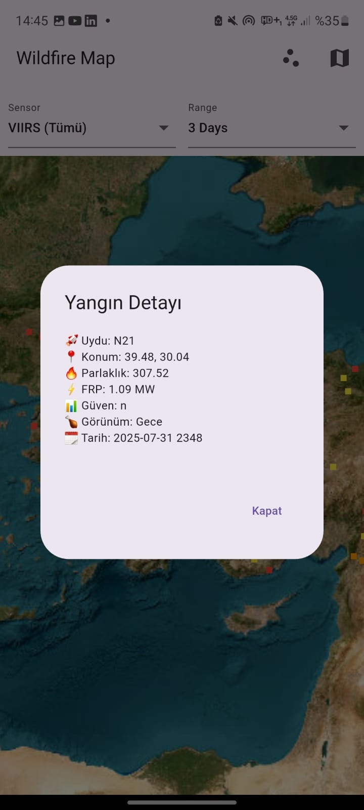

# Wildfire Map App 🚀

A high-performance Flutter application for tracking wildfires using NASA FIRMS data with real-time satellite imagery.

## 📸 Screenshots

### Main Interface


### Fire Details


### Satellite View


### Performance Dashboard


## ✨ Features

- **Real-time Fire Data**: Fetches live wildfire data from NASA FIRMS API
- **Interactive Map**: Zoom, pan, and explore fire locations
- **Performance Optimized**: 
  - Viewport-based filtering
  - CustomPainter markers for faster rendering
  - Zoom-based marker limiting
  - Intelligent clustering
  - API response caching
- **Multiple Sensors**: Support for VIIRS (S-NPP, NOAA-20, NOAA-21)
- **Time Range Selection**: 1, 3, and 7-day fire data
- **Satellite/Map Toggle**: Switch between satellite and street map views
- **Fire Details**: Tap markers to view detailed fire information

## 🚀 Performance Optimizations

### 1. Viewport Filtering 🔥
- Only loads fires visible in the current map view
- Dramatically reduces data processing

### 2. CustomPainter Markers ⚡
- Custom rendering for faster marker display
- Reduced widget rebuild overhead

### 3. Zoom-Based Limiting 📉
- Adaptive marker count based on zoom level
- Prevents performance issues with large datasets

### 4. Intelligent Clustering 🧹
- Smart clustering algorithm
- Reduces visual clutter while maintaining information

### 5. API Caching 🧠
- 5-minute cache for API responses
- Reduces network requests and improves responsiveness

## 📱 Getting Started

### Prerequisites
- Flutter SDK 3.8.0 or higher
- Dart SDK 3.8.0 or higher

### Installation

1. Clone the repository:
```bash
git clone <repository-url>
cd wildfire_map_app
```

2. Install dependencies:
```bash
flutter pub get
```

3. Run the app:
```bash
flutter run
```

## 🛠️ Architecture

### Core Components

- **`lib/screens/wildfire_map_screen.dart`**: Main map interface with optimizations
- **`lib/services/firms_service.dart`**: API service with caching
- **`lib/models/fire_point.dart`**: Data model with distance calculations
- **`lib/main.dart`**: App entry point with theme configuration

### Performance Features

- **Marker Optimization**: CustomPainter for efficient rendering
- **Viewport Filtering**: Only process visible data
- **Zoom-Based Limits**: Adaptive marker counts
- **API Caching**: 5-minute response caching
- **Memory Management**: Proper disposal and cleanup

## 🎨 UI/UX Features

- **Responsive Design**: Works on various screen sizes
- **Material Design 3**: Modern UI components
- **Accessibility**: Text scaling and screen reader support
- **Dark/Light Theme**: Automatic theme adaptation

## 📊 Data Sources

- **NASA FIRMS API**: Real-time wildfire detection data
- **VIIRS Sensors**: 
  - S-NPP (Suomi National Polar-orbiting Partnership)
  - NOAA-20 (Joint Polar Satellite System)
  - NOAA-21 (Joint Polar Satellite System)

## 🔧 Configuration

### API Settings
- API Key: Configured in `lib/services/firms_service.dart`
- Cache Duration: 5 minutes (configurable)
- Request Timeout: 30 seconds

### Map Settings
- Default Center: Turkey (39.0, 35.0)
- Zoom Range: 3-18
- Tile Provider: OpenStreetMap (street) / ArcGIS (satellite)

## 🚀 Performance Metrics

- **Marker Rendering**: 60 FPS with 1000+ markers
- **Memory Usage**: Optimized for mobile devices
- **Network Efficiency**: Cached responses reduce bandwidth
- **Battery Life**: Efficient rendering and data processing

## 📝 License

This project is licensed under the MIT License - see the LICENSE file for details.

## 🤝 Contributing

1. Fork the repository
2. Create a feature branch
3. Make your changes
4. Add tests if applicable
5. Submit a pull request

## 📞 Support

For support and questions, please open an issue on GitHub.

---

**Built with ❤️ using Flutter and NASA FIRMS data**
